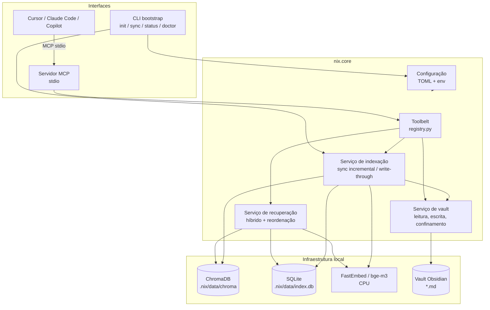
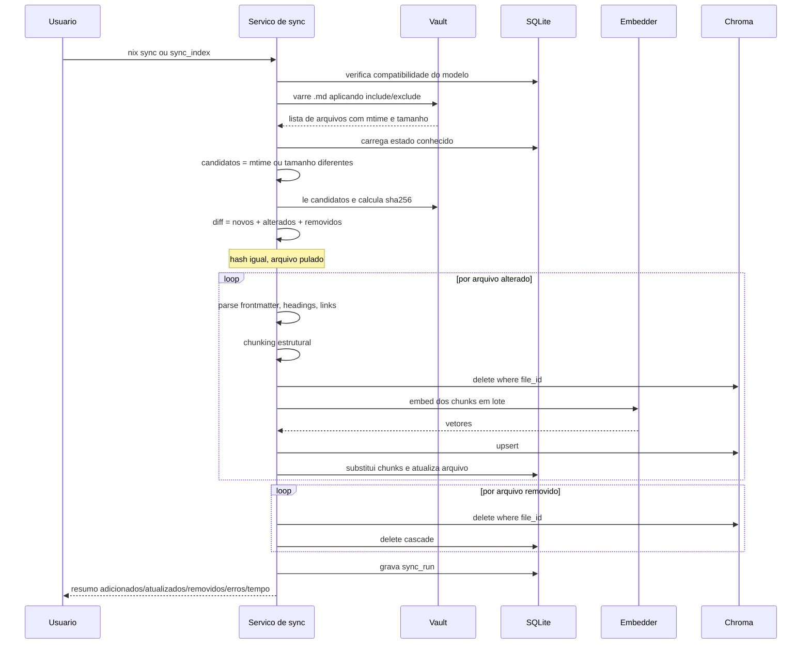
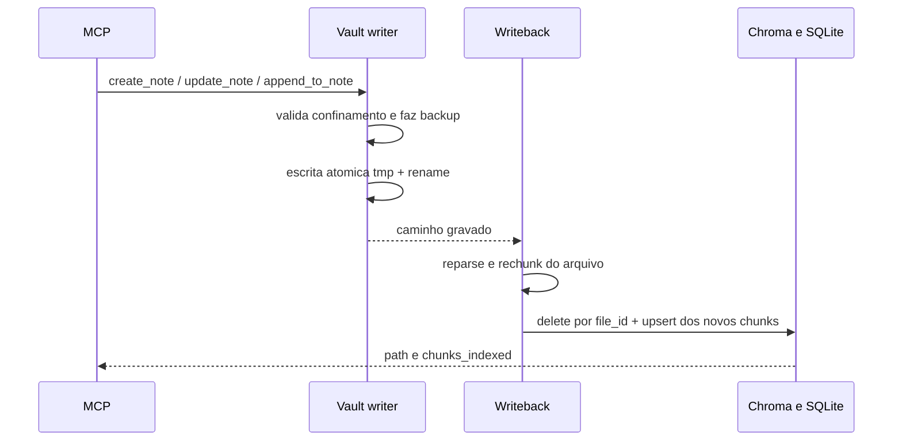
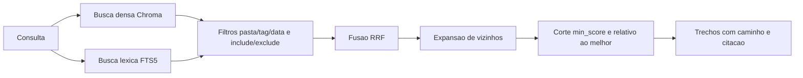

# Arquitetura — Nix

Documento técnico do Nix, servidor MCP que expõe vaults do Obsidian a agentes de desenvolvimento.

Documento de produto e requisitos: [PRD.md](./PRD.md).

---

## 1. Princípios de design

1. **Núcleo independente de interface.** Toda a lógica vive em `nix.core`. CLI e MCP são adaptadores finos que chamam os mesmos serviços. Nenhuma regra de negócio é duplicada.
2. **Local por padrão.** Embeddings e banco vetorial rodam na máquina do usuário, sem custo e sem enviar o vault para terceiros. O Nix não faz chamadas remotas.
3. **Indexação sob consentimento.** Não existe watcher de arquivos. O vault só é varrido quando o usuário pede (`nix sync` / ferramenta `sync_index`) ou quando as próprias ferramentas escrevem (write-through).
4. **O vault é a fonte da verdade.** O índice é um artefato derivado e descartável: apagar `index.data_dir` (padrão `.nix/data` na pasta do aplicativo) e rodar `nix sync --full` reconstrói tudo.
5. **Ferramentas antes de prompts.** A capacidade exposta ao cliente é um conjunto pequeno e bem tipado de ferramentas, definido uma vez em `core/tools/registry.py`.
6. **Falhar de forma explícita.** Erros de configuração, defasagem de índice e ausência de resultados são comunicados, nunca mascarados.

## 2. Stack

| Camada | Tecnologia | Justificativa |
| --- | --- | --- |
| Linguagem | Python 3.11+ | Ecossistema de IA e requisito do projeto |
| Embeddings | FastEmbed com `BAAI/bge-m3` (ONNX, CPU) | Local, gratuito, multilíngue (PT/EN), sem GPU, sem dependência de PyTorch |
| Banco vetorial | ChromaDB em modo persistente | Local, gratuito, embutido, com filtro por metadados |
| Busca léxica | SQLite FTS5 | Já disponível na stdlib; complementa a busca vetorial em termos exatos |
| Estado do índice | SQLite | Controle de arquivos, hashes e chunks; transacional |
| CLI de bootstrap | Typer + Rich | Comandos tipados, ajuda automática, saída formatada e progresso |
| Servidor MCP | SDK oficial `mcp` (FastMCP, **somente stdio**) | O cliente inicia o processo; stdout é do protocolo |
| Configuração | TOML + Pydantic | Arquivo legível, validação forte, override por variável de ambiente |
| Parsing de Markdown | `python-frontmatter` + splitter consciente de cabeçalhos | Preserva metadados e estrutura das notas |
| Qualidade | ruff, mypy | Padrão do ecossistema |

**Por que embeddings locais e não `text-embedding-3`:** o requisito é custo zero na indexação. Um vault grande gera dezenas de milhares de chunks e cada reindexação completa teria custo. `bge-m3` roda em CPU, é multilíngue e tem qualidade adequada para busca semântica em notas pessoais.

**Por que Chroma e não FAISS/LanceDB:** Chroma persiste sozinho, guarda metadados junto do vetor e permite deletar por `file_id` na sincronização incremental. Filtros de pasta/tag/data são aplicados na camada de recuperação (prefixo de pasta, tags, `mtime`), não como `where` de igualdade no Chroma — subpastas continuam visíveis. FAISS exigiria gerenciar o mapeamento id↔metadado manualmente.

## 3. Visão de componentes



## 4. Estrutura do projeto

```
nix/
├── setup.bat / setup.sh / setup.ps1  # cria .venv, instala pacotes, registra PATH e inicia `nix init`
├── bin/nix / bin/nix.cmd   # wrappers da CLI: acham o .venv da instalação, preservam o CWD
├── bin/env.sh / bin/env.cmd / bin/env.ps1  # ativação manual do PATH (terminal antigo)
├── __main__.py             # `python -m nix` a partir do projeto pai (pasta nix/)
├── scripts/bootstrap.py    # venv + pip + init
├── scripts/register_path.py # NIX_HOME e PATH do usuário
├── nix.jpeg                # foto da Nix (mascote no README)
├── nix.toml                # config local (não versionado; gerado por `nix init`)
├── .nix/                   # estado local: data (SQLite+Chroma), backups, logs
├── pyproject.toml          # metadados do pacote e entry point do comando `nix`
├── requirements.txt        # dependências de runtime
├── requirements-dev.txt    # dependências de desenvolvimento
├── README.md
├── PRD.md
├── ARCHITECTURE.md
├── AGENTS.md
├── .cursor/
│   ├── mcp.json            # exemplo: Python do .venv + `python -P -m nix`
│   └── skills/revisao-codigo/
└── src/
    ├── nix_launch.py           # relança o venv, desfaz sombreamento da pasta nix/
    └── nix/
        ├── __init__.py
        ├── __main__.py             # python -m nix (pacote instalado)
        ├── config/
        │   ├── schema.py           # modelos Pydantic da configuração
        │   ├── paths.py            # app_root, nix.toml, resolução de caminhos relativos
        │   ├── loader.py           # precedência env > arquivo > default; avisos de seções legadas
        │   └── template.toml       # config comentado gerado por `nix init`
        ├── core/
        │   ├── vault/
        │   │   ├── reader.py       # varredura, filtros, leitura segura
        │   │   ├── writer.py       # escrita atômica, backup, YAML, confinamento
        │   │   ├── markdown.py     # frontmatter, cabeçalhos, wikilinks, tags
        │   │   ├── paths.py        # normalização e validação de caminhos
        │   │   └── longterm.py     # remember → notas no vault
        │   ├── index/
        │   │   ├── store.py        # SQLite: arquivos, chunks, metadados
        │   │   ├── chunker.py      # divisão consciente da estrutura
        │   │   ├── embedder.py     # FastEmbed em lote (ONNX bge-m3); stdout capturado
        │   │   ├── vectorstore.py  # adaptador Chroma
        │   │   ├── sync.py         # diff e sincronização incremental
        │   │   ├── writeback.py    # reindexação write-through
        │   │   ├── attachments.py  # texto de PDFs referenciados
        │   │   ├── graph.py        # grafo de wikilinks (cache)
        │   │   └── staleness.py    # aviso de defasagem (só Markdown)
        │   ├── retrieval/
        │   │   ├── vector.py       # busca densa
        │   │   ├── lexical.py      # busca FTS5
        │   │   ├── fusion.py       # Reciprocal Rank Fusion
        │   │   ├── rerank.py       # cross-encoder opcional
        │   │   └── service.py      # fachada de recuperação
        │   ├── insights/           # órfãs, duplicatas, links, resumo
        │   └── tools/
        │       ├── registry.py     # definição canônica das ferramentas
        │       ├── search.py
        │       ├── notes.py
        │       └── maintenance.py
        ├── cli/
        │   ├── app.py              # entrypoint Typer (sem args → servidor stdio)
        │   ├── ascii-art.txt
        │   ├── commands/
        │   │   ├── setup.py        # init, doctor
        │   │   └── index_cmds.py   # sync, status (status via call_tool)
        │   └── render.py           # banner, tabelas de sync/status, erros em stderr
        ├── mcp/
        │   ├── server.py           # FastMCP/MCPServer stdio
        │   ├── traffic.py          # log de interações MCP (arquivo)
        │   └── resources.py        # nix://note/{+rel_path}
        └── observability/
            ├── logging.py
            └── stdio.py            # isola stdout de bibliotecas
```

O ambiente é gerenciado com `venv` e `pip`. O instalador (`setup.bat` / `setup.sh` → `scripts/bootstrap.py`) cria `.venv`, instala `requirements.txt` e o pacote em modo editável (`pip install -e .`) e dispara `nix init`. Quem preferir o fluxo manual usa os mesmos passos. O `pyproject.toml` se limita aos metadados do pacote e à declaração do *entry point* `nix`.

## 5. Modelo de dados

### 5.1 SQLite (`index.data_dir/index.db`, padrão `.nix/data/index.db` na pasta do app)

Guarda o estado do índice: o que já foi processado, com qual conteúdo e com qual modelo. É a base do diff incremental.

```sql
CREATE TABLE files (
    id            TEXT PRIMARY KEY,       -- uuid estável por caminho relativo
    rel_path      TEXT NOT NULL UNIQUE,   -- 'Projetos/Nix.md'
    title         TEXT,
    content_hash  TEXT NOT NULL,          -- sha256 do conteúdo
    mtime         REAL NOT NULL,
    size_bytes    INTEGER NOT NULL,
    frontmatter   TEXT,                   -- JSON
    tags          TEXT,                   -- JSON array
    links         TEXT,                   -- JSON array de wikilinks
    chunk_count   INTEGER NOT NULL DEFAULT 0,
    indexed_at    TEXT NOT NULL,
    status        TEXT NOT NULL           -- indexed | error | ignored
);

CREATE TABLE chunks (
    id            TEXT PRIMARY KEY,       -- '{file_id}:{ordinal}'
    file_id       TEXT NOT NULL REFERENCES files(id) ON DELETE CASCADE,
    ordinal       INTEGER NOT NULL,
    heading_path  TEXT,                   -- 'Arquitetura > Indexação'
    content       TEXT NOT NULL,
    title         TEXT NOT NULL DEFAULT '',
    token_count   INTEGER NOT NULL,
    start_line    INTEGER,
    end_line      INTEGER
);

-- Busca léxica sobre os mesmos chunks
CREATE VIRTUAL TABLE chunks_fts USING fts5(
    content, heading_path, title,
    content='chunks', content_rowid='rowid', tokenize='unicode61'
);

CREATE TABLE index_meta (
    key   TEXT PRIMARY KEY,               -- embedding_model, dim, vault_path,
    value TEXT NOT NULL                   -- schema_version, last_sync_at
);

CREATE TABLE sync_runs (
    id           INTEGER PRIMARY KEY AUTOINCREMENT,
    started_at   TEXT NOT NULL,
    finished_at  TEXT,
    trigger      TEXT NOT NULL,           -- manual | writeback
    added        INTEGER DEFAULT 0,
    updated      INTEGER DEFAULT 0,
    removed      INTEGER DEFAULT 0,
    failed       INTEGER DEFAULT 0,
    error_log    TEXT
);
```

`index_meta.embedding_model` é comparado a cada execução: se o usuário trocar o modelo na configuração, o índice é considerado incompatível e o Nix exige `nix sync --full` em vez de misturar vetores de espaços diferentes.

### 5.2 Coleção Chroma

Uma coleção `nix_notes`, um vetor por chunk, `id` idêntico ao `chunks.id`. Metadados armazenados junto:

| Campo | Uso |
| --- | --- |
| `file_id` | Deleção em massa na reindexação de um arquivo |
| `rel_path`, `title` | Citação e abertura da nota |
| `heading_path` | Contexto do trecho na resposta |
| `tags` | Filtro por tag (após a busca; armazenado como string concatenada no Chroma) |
| `folder` | Prefixo da pasta (inclui subpastas), filtrado após a busca — sem `where` de igualdade no Chroma |
| `mtime` | Filtro por recência e desempate |
| `ordinal` | Reconstrução da ordem e expansão de vizinhos |

## 6. Pipeline de indexação

### 6.1 Detecção de mudanças



O filtro em duas etapas — `mtime`/tamanho primeiro, hash depois — evita ler todo o vault a cada sincronização e evita reindexar arquivos que só tiveram o timestamp alterado (comum em sincronização por Dropbox/Git).

Cada arquivo é uma transação independente: uma interrupção deixa o índice consistente, e a execução seguinte reprocessa apenas o que faltou (RNF-07).

### 6.2 Chunking

Notas de Obsidian têm estrutura semântica em cabeçalhos, e cortá-las por número fixo de caracteres destrói essa estrutura. A estratégia:

1. Extrair frontmatter YAML (vira metadado JSON-serializável — datas ISO — não texto indexado).
2. Dividir por cabeçalhos Markdown (`#` até `####`), mantendo o caminho hierárquico (`Projeto Nix > Arquitetura > Indexação`).
3. Seções maiores que o limite são subdivididas recursivamente por parágrafo/sentença, com sobreposição configurável.
4. Seções muito pequenas (ex.: um cabeçalho com duas linhas) são agrupadas com a seção seguinte, evitando chunks sem sinal.
5. Blocos de código nunca são partidos ao meio.
6. Cada chunk é prefixado, apenas para o embedding, com `título da nota > caminho de cabeçalhos`, o que melhora a recuperação de trechos curtos.

Valores padrão: 800 tokens por chunk, 120 de sobreposição, mínimo de 80 tokens — todos configuráveis.

### 6.3 Vetorização write-through

Quando a escrita parte das ferramentas MCP, a atualização do índice faz parte da operação (RN-02):



O reprocessamento é de um único arquivo. Se a indexação falhar após a escrita, o arquivo no vault permanece (fonte da verdade), o registro vai para `status = 'error'` e a resposta informa que a nota foi salva mas não indexada — o usuário deve rodar `nix sync` ou `sync_index`. Frontmatter YAML é gravado com valores escapados; datas (`created: auto` → ISO) serializam como string, para o JSON do SQLite não quebrar em objetos `date`.

### 6.4 Aviso de defasagem

`index_status` compara a **contagem de notas Markdown** visíveis no vault com a de arquivos `.md` indexados, e o `mtime` máximo com `index_meta.last_sync_at`. PDFs anexos no índice não entram nessa conta (evita aviso falso de defasagem). Se houver divergência, devolve `stale=true`. A mensagem `stale_reason` só é preenchida quando `index.warn_when_stale=true`. Não há indexação implícita (RN-01).

## 7. Recuperação



- **Densa** resolve similaridade conceitual ("como configurar o retry" ↔ "política de nova tentativa").
- **Léxica** resolve termos exatos que embeddings costumam diluir: nomes próprios, siglas, códigos de erro, nomes de arquivo. `retrieval.expand_query=true` junta tokens com OR (mais recall); `false` usa AND (mais precisão).
- **Filtro de pasta** vale para a pasta e subpastas (`Inbox` inclui `Inbox/sub/nota.md`), aplicado em cada ramo **antes** do RRF.
- **RRF** funde os dois rankings: `score(d) = Σ 1 / (k + rank_i(d))`, com `k = 60`.
- **Expansão de vizinhos** recupera os chunks `ordinal ± 1` dos melhores resultados.
- **Corte de score** descarta trechos abaixo de `max(min_score, melhor × 0.65)`.
- **Reordenação** é opcional (`retrieval.rerank`), com cross-encoder local (`index.rerank_model`), aplicada ao top-20.

Cada trecho devolvido por `search_notes` inclui `rel_path`, `title`, `heading_path`, `content` e `citation` no formato `[[Título]]` / `[[Título#Seção]]` (RN-04). A síntese em linguagem natural é responsabilidade do cliente MCP.

## 8. Ferramentas

Definidas uma única vez em `core/tools/registry.py` e registradas no servidor MCP. A CLI de bootstrap chama `call_tool` para `index_status`; `nix sync` usa o mesmo `Indexer.sync` da ferramenta (com barra de progresso).

| Ferramenta | Assinatura | Efeito no índice |
| --- | --- | --- |
| `search_notes` | `(query, top_k=5, folder?, tags?, date_from?, date_to?) -> list[Chunk]` | — |
| `read_note` | `(rel_path) -> NoteContent` | — |
| `list_notes` | `(folder?, tag?, limit=50) -> list[NoteRef]` (`rel_path`, `title`, `tags`) | — |
| `get_linked_notes` | `(rel_path, direction=both) -> list[NoteRef]` | — |
| `create_note` | `(rel_path, content, frontmatter?) -> WriteResult` | write-through; pasta padrão `vault.default_new_note_folder` (`Inbox`) se o caminho não tiver `/` |
| `append_to_note` | `(rel_path, content, section?) -> WriteResult` | write-through |
| `update_note` | `(rel_path, content, mode=replace\|patch, confirm) -> WriteResult` | write-through |
| `delete_note` | `(rel_path, confirm) -> WriteResult` | remove do índice |
| `sync_index` | `(full=False, dry_run=False) -> SyncReport` | sincronização manual |
| `index_status` | `() -> IndexStatus` | — |
| `vault_insights` | `(kind, limit=20) -> insights` | — |
| `remember` | `(content, title?) -> WriteResult` | write-through em `vault.longterm_folder` |

Ferramentas destrutivas (`update_note` em modo `replace`, `delete_note`) exigem `confirm=true` e levam `destructiveHint` para o cliente pedir aprovação ao usuário (RF-34).

`vault_insights` (órfãs, duplicatas, sugestão de wikilinks, resumo) usa o índice SQLite. A sugestão de links não relê o vault.

Todas as ferramentas recebem `rel_path` relativo ao vault. `core/vault/paths.py` resolve, normaliza, rejeita `..`, caminhos absolutos e links simbólicos que escapem do vault (RN-03).

## 9. Interfaces

### 9.1 Instalador e CLI de bootstrap

O instalador na raiz do repositório não entra no núcleo: só orquestra o ambiente.

```
setup.bat / setup.sh / setup.ps1  # acha Python 3.11+, chama scripts/bootstrap.py
scripts/bootstrap.py          # .venv → pip (requirements.txt + -e .) → register_path → python -P -m nix init
scripts/register_path.py      # NIX_HOME + `{NIX_HOME}/bin` no PATH (registro Windows / rc Unix)
bin/nix / bin/nix.cmd         # shims no PATH do usuário
bin/env.sh / env.cmd / env.ps1  # ativação manual se um terminal antigo não herdou o PATH
```

Argumentos extras (`--vault PATH`, `--force`) vão para `nix init`. Se `.venv` já existir, é reutilizado. O instalador grava `NIX_HOME` e coloca `{NIX_HOME}/bin` no PATH (registro do usuário no Windows; bloco POSIX nos rcs existentes, criando `~/.bashrc` só se nenhum rc existir; no Git Bash com `MSYSTEM`, cria `~/.bashrc` se preciso). Windows e shell são registrados à parte: a falha de um não desfaz o outro. Se algum registro falhar, a instalação **não aborta**: aponta para o INSTALL.md e segue o `init`. Depois do vault, informa que a configuração foi concluída; o comando `nix` vale num **novo** terminal. Se já existir outro `nix` no PATH (gerenciador NixOS), o instalador avisa.

```
nix                           # inicia o servidor MCP stdio
nix init [--vault PATH] [--force]
                              # pergunta (ou recebe) o vault; cria nix.toml na pasta do Nix
                              # sem --force, arquivo existente só atualiza vault.path
nix sync [--full] [--dry-run] [--json]
nix status [--json]           # via call_tool("index_status")
nix doctor [--json]           # resumo; --json emite dump da config validada
```

`--json` em `sync` e `status` emite o relatório em formato estruturado. `nix doctor --json` serializa a configuração (incluindo `unknown_sections` e `legacy_warnings`). Erros de domínio (`NixError`) saem no stderr, sem traceback.

Se `nix` roda sem subcomando num terminal interativo, um aviso vai para stderr e o servidor stdio inicia mesmo assim — o cliente MCP (stdin não-TTY) não vê essa mensagem.

### 9.2 Servidor MCP

Transporte **somente stdio**. O cliente inicia o processo (`python -P -m nix` no venv). Expõe as ferramentas da seção 8 e, adicionalmente, notas como recursos MCP (`nix://note/{+rel_path}` — barras no caminho; `|` também é aceito), permitindo que o cliente anexe uma nota inteira ao contexto sem consumir uma chamada de ferramenta.

O servidor tenta `FastMCP` e, se o SDK recente expuser só `MCPServer`, usa essa classe — ambas precisam de `.tool()`, `.run()` e `transport="stdio"`. Falha de instância ou de transporte vira `ConfigError` com ação corretiva (`pip install 'mcp>=1.9.0'`). `NixError` na subida vai para stderr e encerra com código 1, sem vazar traceback no stdout.

Registro no Cursor (`.cursor/mcp.json`). O processo da IDE **não** tem o `PATH` do venv — use o Python do ambiente, não o comando `nix`. O `-P` impede que a pasta `nix/` do workspace sombreie o pacote:

```json
{
  "mcpServers": {
    "nix": {
      "command": "${env:NIX_HOME}/bin/nix.cmd"
    }
  }
}
```

Se o workspace **é** o repositório Nix, `command` aponta para `${workspaceFolder}/.venv/Scripts/python.exe` (ou `.venv/bin/python` no Unix). O comando `nix` no PATH do terminal (via `NIX_HOME`) **não** substitui esse registro: a IDE não herda o PATH do usuário.

O servidor não escreve em stdout — o canal é do protocolo. Interações (`initialize`, `tools/list`, `tools/call`, `resources/read`) vão só para o arquivo de log. Argumentos das ferramentas (consultas, caminhos) só entram no log se `logging.log_prompts=true`. `ping` e notificações ficam em nível debug.

## 10. Configuração

Arquivo TOML único, procurado nesta ordem: `$NIX_CONFIG` (se definido, é o único candidato) → `{app_root}/nix.toml` → `nix.toml` no CWD e nos diretórios pais (último recurso). `app_root` é o checkout editável, senão `$NIX_HOME`, senão o CWD. Caminhos relativos resolvem contra o diretório do arquivo, não o CWD. Precedência de valores: **variável de ambiente > arquivo > padrão** (RF-03). Variáveis no formato `NIX_SECAO__CAMPO` (ex.: `NIX_VAULT__PATH`). `nix init` grava no mesmo caminho (`config_write_path`). Estado (SQLite, Chroma, backups, logs) fica em `{app_root}/.nix/`.

Seções fora de `vault` / `index` / `retrieval` / `safety` / `logging` são ignoradas e geram aviso. As chaves legadas `[openai]`, `[agent]`, `[mcp]` e `[limits]` têm mensagem específica; `agent.longterm_folder` é copiado para `vault.longterm_folder` **só nesta sessão** até o TOML ser editado.

```toml
# nix.toml — gerado por `nix init` na pasta do Nix

[vault]
path = "C:/Obsidian/MeuVault"
include = ["**/*.md"]
exclude = [".obsidian/**", ".trash/**", "Templates/**", "Privado/**"]
follow_symlinks = false
default_new_note_folder = "Inbox"
default_frontmatter = { created = "auto", source = "nix" }
longterm_folder = "Nix/Memória"

[index]
data_dir = ".nix/data"
embedding_model = "BAAI/bge-m3"
embedding_batch_size = 32
chunk_size_tokens = 800
chunk_overlap_tokens = 120
min_chunk_tokens = 80
auto_sync_external_changes = false
auto_index_agent_writes = true
warn_when_stale = true
index_attachments = true
# Usado só se retrieval.rerank = true
rerank_model = "Xenova/ms-marco-MiniLM-L-6-v2"

[retrieval]
top_k = 5
candidate_pool = 20
hybrid = true
lexical_weight = 0.4
rrf_k = 60
neighbor_expansion = 1
min_score = 0.25
rerank = false
expand_query = true

[safety]
confirm_destructive = true
backup_before_overwrite = true
backup_dir = ".nix/backups"
backup_retention_days = 30

[logging]
level = "info"
file = ".nix/logs/nix.log"
log_prompts = false
```

Toda a configuração é validada por Pydantic no carregamento: caminho do vault deve existir e ser diretório, modelos devem estar entre os suportados, valores numéricos em faixas válidas. Erros trazem o campo e a ação corretiva (RF-04, RNF-09). No Windows, `vault.path` deve usar `/` (ex.: `C:/Obsidian/MeuVault`); barra invertida quebra o TOML.

## 11. Segurança

| Vetor | Controle |
| --- | --- |
| Escrita fora do vault | Resolução canônica de caminho e verificação de prefixo; rejeição de `..`, caminhos absolutos e symlinks que escapem |
| Perda de conteúdo | Escrita atômica (arquivo temporário + rename), backup versionado antes de sobrescrever, confirmação obrigatória |
| Exposição de notas privadas | Filtros `exclude` aplicados na indexação **e** na leitura, para que uma nota excluída não seja acessível nem por `read_note` |
| Corrupção do protocolo MCP | stdout reservado ao stdio; logs só em arquivo; `silence_progress_env` na inicialização; FastEmbed sob `capture_library_stdout`; `NixError` só no stderr |
| Injeção via conteúdo de nota | Trechos recuperados são dados estruturados (caminho + conteúdo); ferramentas destrutivas sempre exigem confirmação humana |
| Corrupção do índice | Transação por arquivo, verificação de compatibilidade de modelo, reconstrução completa sempre disponível |

## 12. Desempenho

| Operação | Alvo | Estratégia |
| --- | --- | --- |
| Sync incremental sem mudanças (5.000 notas) | < 2s | Comparação por `mtime`/tamanho antes de ler conteúdo |
| Sync inicial (1.000 notas) | ~5 min sem GPU | Embedding em lote, ONNX em CPU, paralelismo de parsing |
| Reindexação write-through de 1 nota | < 100ms | Escopo de um único arquivo |
| Busca híbrida | < 500ms | HNSW do Chroma + FTS5, ambos locais |

O carregamento do modelo de embedding é preguiçoso. O FastEmbed 0.8 não lista `BAAI/bge-m3`; o Nix registra o ONNX oficial na hora (`embedder.py`) e o primeiro uso baixa ~2,3 GB do Hugging Face. `nix status` não carrega o modelo.

## 13. Decisões arquiteturais

| # | Decisão | Alternativas consideradas | Motivo |
| --- | --- | --- | --- |
| AD-01 | Embeddings locais (`bge-m3` via FastEmbed) | `text-embedding-3-small` da OpenAI | Custo zero na indexação e reindexação; multilíngue e sem GPU |
| AD-02 | ChromaDB persistente | FAISS, LanceDB, Qdrant local, pgvector | Persistência e deleção por `file_id` nativas; filtros de pasta/tag na camada de recuperação |
| AD-03 | SQLite como estado do índice | Arquivo JSON de manifesto | Transacional, consultável, e traz FTS5 de graça para a busca léxica |
| AD-04 | Sem LLM no Nix | LangGraph + OpenAI no processo | O raciocínio fica no cliente MCP (Cursor, Claude Code, Copilot); o Nix só entrega ferramentas |
| AD-05 | Sincronização manual, sem watcher | `watchdog` observando o vault | Requisito de controle do usuário; evita processo em background e reindexações em rajada durante edição |
| AD-06 | Registry único de ferramentas | Implementações separadas para CLI e MCP | Elimina divergência de comportamento e duplicação de regras de segurança |
| AD-07 | Busca híbrida desde a fundação | Somente densa | Notas pessoais são cheias de nomes próprios e siglas que o embedding dilui |
| AD-08 | Artefatos de índice na pasta do aplicativo (`.nix/`), fora do vault | `.nix/` dentro do vault | Evita poluir a sincronização do Obsidian; o estado acompanha o aplicativo |
| AD-09 | MCP somente stdio | HTTP loopback | O cliente inicia o processo; não há porta, autenticação nem processo órfão |
| AD-10 | Instalador em script (`setup.bat` / `setup.sh` + `scripts/bootstrap.py`) | Pacote PyInstaller, Makefile | Não empacota Python; usa o 3.11+ do sistema, funciona em Windows e Unix, e reutiliza `nix init` |

## 14. Evolução prevista

- Conjunto de avaliação `eval/` (harness e perguntas; ainda não está no repositório).
- Reordenação com cross-encoder ligada por padrão e outras melhorias de qualidade.
- Registro documentado para mais clientes MCP (Claude Code, Copilot) além do exemplo do Cursor.
