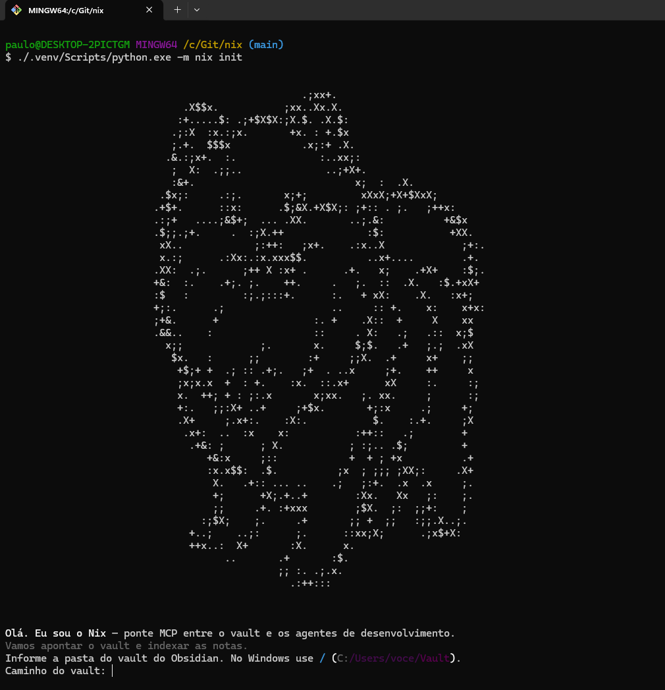

# Nix

<p align="center">
  
</p>

<p align="center">
  <a href="https://github.com/paulocesaaars/nix/releases/latest"></a>
  <a href="https://www.python.org/downloads/"></a>
</p>

Servidor [MCP](https://modelcontextprotocol.io/) que expõe um vault do Obsidian a agentes de desenvolvimento (Cursor, Claude Code, Copilot). Busca híbrida, leitura e escrita nas notas — com embeddings e banco vetorial **locais e gratuitos**. O raciocínio fica no cliente; o Nix só entrega ferramentas.

Transporte: **MCP stdio**. Sem subcomando, `nix` inicia o servidor.

## Por que usar

- O agente do editor **encontra ideias**, não só palavras: busca semântica + léxica no vault.
- **Cria e atualiza notas** no formato do Obsidian, sem sair do Cursor.
- Tudo roda **na sua máquina**. Nenhum trecho do vault vai para API de embedding.
- Você controla quando o índice muda: não há watcher em segundo plano.

## Requisitos

- Python 3.11+ no `PATH`
- Um vault do Obsidian (notas `.md`)
- ~2,3 GB livres na primeira sincronização (download do modelo `BAAI/bge-m3`)

## Instalação

Há dois caminhos. Os dois criam `.venv`, instalam o pacote e disparam `nix init` (pergunta o caminho do vault, ou aceite `--vault`).

### No seu projeto (usuário)

1. Baixe a [última release](https://github.com/paulocesaaars/nix/releases/latest) (`nix-x.y.z.zip`).
2. Extraia **na raiz do workspace** e renomeie a pasta para `nix` (o zip vem como `nix-1.0.0/`).
3. Rode o instalador **dentro dessa pasta**:

```bat
cd nix
setup.bat
:: ou, se já souber o vault:
setup.bat --vault "C:/Users/voce/Vault"
```

```bash
cd nix
chmod +x setup.sh
./setup.sh
# ou: ./setup.sh --vault "$HOME/Vault"
```

No Windows use barras `/` no caminho do vault (`C:/Users/voce/Vault`). Barra invertida quebra o TOML.

<p>
  
</p>

Depois registre o servidor no editor — veja [Registro no cliente MCP](#registro-no-cliente-mcp).

### A partir do repositório (desenvolvedor)

Clone o repositório e rode o mesmo instalador na raiz:

```bat
setup.bat
:: ou: setup.bat --vault "C:/Users/voce/Vault"
```

```bash
chmod +x setup.sh
./setup.sh
# ou: ./setup.sh --vault "$HOME/Vault"
```


Instalação manual (equivale ao instalador, com dependências de desenvolvimento):

```bash
python -m venv .venv
# Windows (Git Bash): source .venv/Scripts/activate
# Linux/macOS:        source .venv/bin/activate

pip install -r requirements-dev.txt
pip install -e .
python -m nix init                # ou: python -m nix init --vault "C:/Users/voce/Vault"
```

`nix` e `python -m nix` são equivalentes **depois** de ativar o venv. O Cursor não herda o `PATH` do terminal — no MCP use sempre o Python do `.venv`.

## Registro no cliente MCP

O cliente inicia o processo. A IDE **não** herda o `PATH` do terminal: o comando `nix` do venv não é encontrado e a conexão fecha (`'nix' não é reconhecido`).

Aponte para o Python do ambiente virtual. Recarregue os servidores MCP depois de salvar.

**Cursor** — `.cursor/mcp.json` no workspace:

```json
{
  "mcpServers": {
    "nix": {
      "command": "${workspaceFolder}/nix/.venv/Scripts/python.exe",
      "args": ["-m", "nix"]
    }
  }
}
```

Ajuste `command` conforme o caso:

| Onde o Nix está | Windows | Linux / macOS |
| --- | --- | --- |
| Pasta `nix/` dentro do projeto | `${workspaceFolder}/nix/.venv/Scripts/python.exe` | `${workspaceFolder}/nix/.venv/bin/python` |
| O workspace **é** o repositório Nix | `${workspaceFolder}/.venv/Scripts/python.exe` | `${workspaceFolder}/.venv/bin/python` |

O mesmo padrão (`caminho/do/python` + `["-m", "nix"]`) vale para Claude Code e Copilot. stdout é do protocolo MCP: logs só em `~/.nix/logs/nix.log`.

## Primeiros passos

Depois do `init` (o instalador já dispara isso):

```bash
# Windows
nix.cmd doctor
nix.cmd sync
nix.cmd status

# Linux / macOS
./nix doctor
./nix sync
./nix status
```

O primeiro `sync` (ou qualquer operação que embede) baixa o modelo `BAAI/bge-m3` (~2,3 GB) do Hugging Face. Nas seguintes, só o que mudou é reprocessado.

Notas novas sem pasta no caminho vão para `vault.default_new_note_folder` (padrão `Inbox`).

## Indexação

Esta é a regra central:

> Alterações feitas **fora** do Nix (Obsidian, editor) **não** são indexadas sozinhas. Alterações feitas pelas ferramentas MCP atualizam o índice na mesma operação.

Depois de editar no Obsidian, rode `nix sync` ou peça `sync_index` ao agente. Se a vetorização de uma escrita falhar, o arquivo permanece no vault (fonte da verdade) e um `nix sync` corrige o índice.

## CLI

| Comando | Função |
| --- | --- |
| `nix` | Inicia o servidor MCP stdio |
| `nix init [--vault PATH] [--force]` | Cria a configuração e grava o caminho do vault |
| `nix sync [--full] [--dry-run] [--json]` | Sincroniza o índice (nunca automático) |
| `nix status [--json]` | Notas, chunks, último sync e defasagem |
| `nix doctor [--json]` | Diagnóstico de ambiente, config e índice |

## Ferramentas MCP

Doze ferramentas, definidas em `src/nix/core/tools/registry.py`. Notas também aparecem como recurso `nix://note/{+rel_path}`.

| Ferramenta | Uso |
| --- | --- |
| `search_notes` | Busca híbrida (semântica + léxica), com filtros de pasta, tags e datas |
| `read_note` | Lê a nota inteira |
| `list_notes` | Lista notas indexadas (pasta, tag) |
| `get_linked_notes` | Navega wikilinks (`outgoing`, `incoming` ou `both`) |
| `create_note` | Cria nota e indexa na hora (write-through) |
| `append_to_note` | Anexa conteúdo e reindexa |
| `update_note` | `replace` exige `confirm=true`; `patch` anexa |
| `delete_note` | Remove nota e índice; exige `confirm=true` |
| `sync_index` | Sincronização manual (`full`, `dry_run`) |
| `index_status` | Contagens, último sync e defasagem |
| `vault_insights` | Órfãs, duplicatas, sugestão de links ou resumo |
| `remember` | Grava fato duradouro em `vault.longterm_folder` |

## Configuração

Arquivo (primeiro encontrado): `$NIX_CONFIG` → `./nix.toml` → `~/.nix/config.toml`. Variáveis `NIX_SECAO__CAMPO` sobrescrevem o arquivo (ex.: `NIX_VAULT__PATH`).

Pontos úteis do TOML gerado pelo `init`:

| Chave | Padrão | Função |
| --- | --- | --- |
| `vault.path` | — | Pasta raiz do Obsidian |
| `vault.exclude` | `.obsidian`, `.trash`, `Templates`, `Privado` | Pastas ignoradas |
| `vault.default_new_note_folder` | `Inbox` | Destino de notas sem pasta no caminho |
| `vault.longterm_folder` | `Nix/Memória` | Destino da ferramenta `remember` |
| `index.data_dir` | `~/.nix/data` | SQLite + Chroma (fora do vault) |
| `logging.file` | `~/.nix/logs/nix.log` | Logs; consultas só entram se `log_prompts = true` |

## Publicar uma versão

Uma release no GitHub é criada automaticamente quando uma tag `vX.Y.Z` chega no remoto. O workflow [`.github/workflows/release.yml`](.github/workflows/release.yml) confere a versão, roda `ruff` e `mypy`, monta `nix-x.y.z.zip` e publica em [Releases](https://github.com/paulocesaaars/nix/releases).

1. Atualize `[project].version` em `pyproject.toml` (ex.: `1.0.2`). A tag **precisa** bater com esse valor — senão o job falha.
2. Faça o commit e o push na branch principal.
3. Crie e envie a tag (o `v` no prefixo é obrigatório):

```bash
git tag v1.0.2
git push origin v1.0.2
```

4. Acompanhe o workflow **Release** em Actions. Em caso de sucesso, a release `Nix v1.0.2` aparece com o zip e o checksum `.sha256`.

Para republicar os artefatos de uma tag que já existe, dispare o workflow à mão: Actions → Release → Run workflow, e informe a tag (ex.: `v1.0.2`).

## Documentação

- [PRD.md](PRD.md) — produto, requisitos e regras de negócio
- [ARCHITECTURE.md](ARCHITECTURE.md) — componentes, indexação, recuperação e MCP stdio
